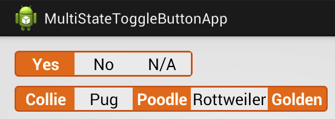

Multi State Toggle Button
=========================

A simple multi-state toggle button for Android.



## Usage ##

To use this library you need to clone this repo to your workspace and add the `MultiStateToggleButton` project as a library in your project dependencies.

Then in your activity's XML declare:

```
<LinearLayout xmlns:android="http://schemas.android.com/apk/res/android"
    xmlns:tools="http://schemas.android.com/tools"
    android:layout_width="match_parent"
    android:layout_height="match_parent"
    android:orientation="vertical"

	<org.honorato.multistatetogglebutton.MultiStateToggleButton
		android:id="@+id/mstb_multi_id"
		android:layout_width="wrap_content"
		android:layout_height="wrap_content"
		android:layout_marginTop="10dip"
		android:entries="@array/planets_array" />

</LinearLayout>
```

If you need a callback for when the value changes then add this to your code:

```
MultiStateToggleButton button2 = (MultiStateToggleButton) this.findViewById(R.id.mstb_multi_id);
button2.setOnValueChangedListener(new ToggleButton.OnValueChangedListener() {
	@Override
	public void onValueChanged(int value) {
		Log.d(TAG, "Value: " + value);
	}
});
```

Be sure to declare an array of strings called `planets_array` in your `strings.xml`:

```
<string-array name="planets_array">
	<item>Mer</item>
	<item>Venus</item>
	<item>Earth</item>
	<item>Mars</item>
</string-array>
```
